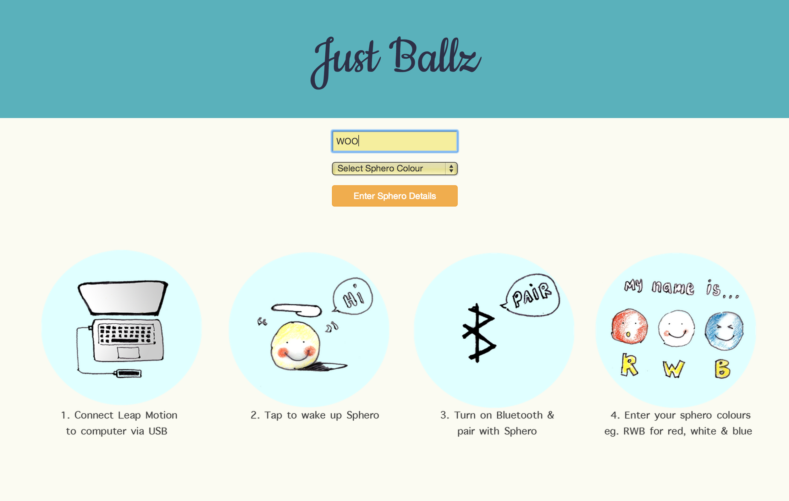
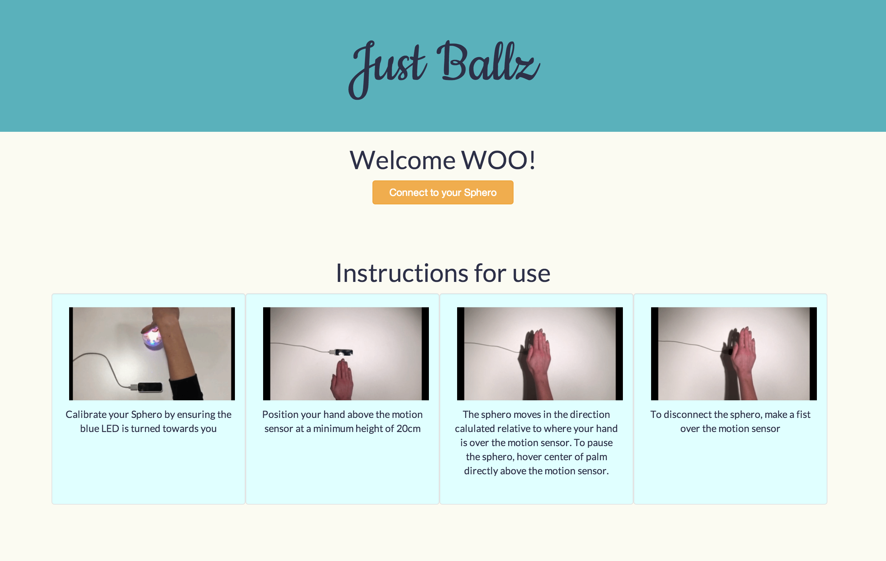
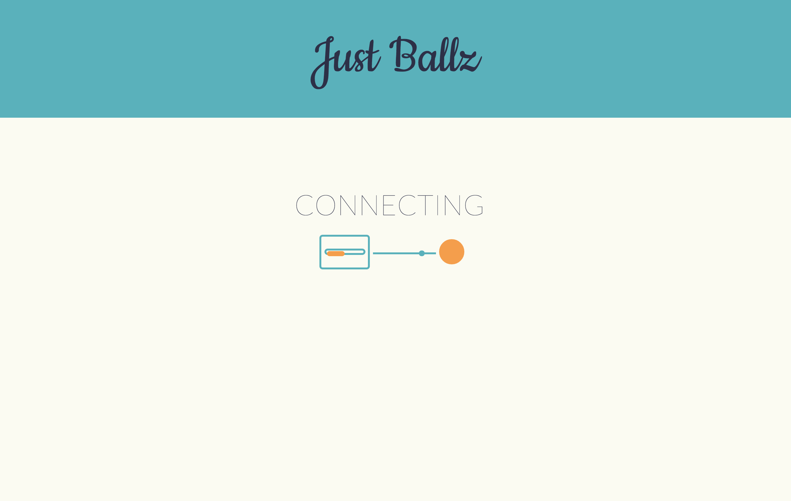
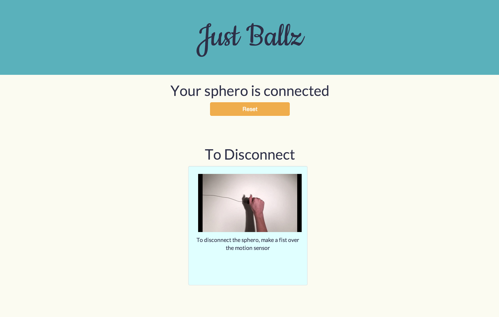

JUST BALLZ
============

A project to allow gesture based movement of a robot by integrating [Sphero robots](www.sphero.com) and [Leap Motion](www.leapmotion.com) into a native app for Mac OSX.

The app was built using a Javascript stack. With the technologies of note including: Node, Angular, Leap, Sphero, Serial Port and Node Webkit.

This application is still in Alpha and as such there are a number of bugs present that can cause hiccups in usage please report any unexpected behaviour using github issues.

Continuous Integration
--------------------------
Master: 
Development: 

Download & Installation
-----------------------
As a pre-requisite for running this app the following are required:

- Sphero
- Leap Motion

You can download the Alpha version of the App [here](https://www.dropbox.com/s/dli2elziuqux9q3/Just%20Ballz.app.zip?dl=0).

How To Use
----------
- For a full App walkthrough click below to view our YouTube tutorial.

- Once the app has been successully downloaded it can be run from any location by simply double clicking on the Just Ballz icon. This will open the apps landing page as shown below:

- Follow the instructions to enter your Sphero's 3 letter name, select a color for it and then click "Enter Sphero Details".

- This will take you through to the Connection page where you can review instructions on how to control your Sphero.

- When you are happy click connect.

- After a few seconds your Sphero will turn orange and its backlight will turn on. This backlight denotes Sphero's orientation.

- Place your Sphero down and orientate it using the backlight as a guide.

- After a few further seconds the Sphero will turn the color you selected and the screen will change.

- Place your hand above the LeapMotion and move your hand in the direction that you wish your Sphero ball to roll.

- To stop your Sphero simply move your palm directly over the LeapMotion.

- When you would like to disconnect from the Sphero close your hand into a fist.

- Once you have disconnected click the reset button to use the application again.

Contributions
-------------
Contributions and issues are very welcome. To contribute simply fork this directory make your changes and then open a pull request.
